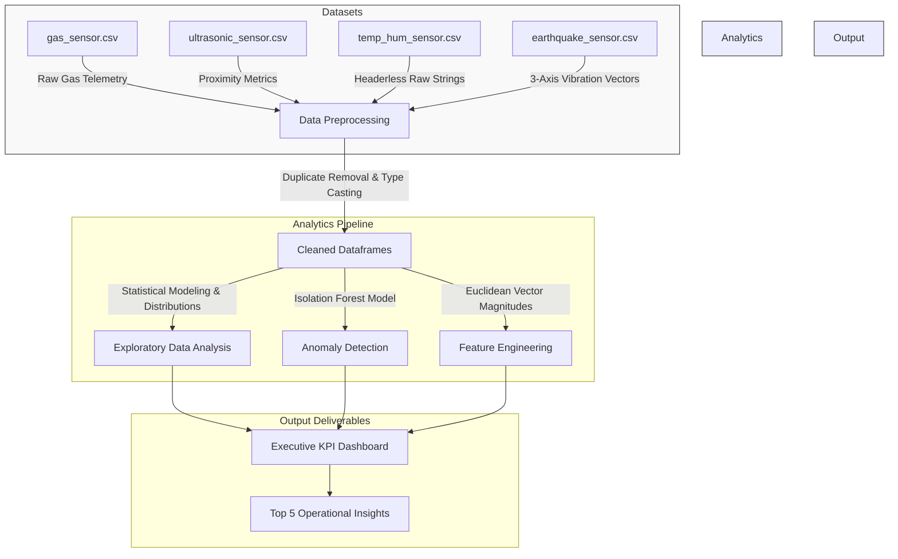

# 🌐 IoT Sensor Monitoring & Data Analytics Dashboard

An end-to-end, professional-grade data analytics, preprocessing, and anomaly detection pipeline for multi-modal IoT sensor datasets. This project ingests raw sensor telemetry, cleans and normalizes the data, detects complex environmental anomalies using machine learning, and compiles an executive dashboard of key performance indicators (KPIs) and operational insights.

---

## 🏗️ Analytics Architecture

The following diagram illustrates how the raw telemetry flows through the cleaning and analytics pipeline:



---

## 📊 Summary of Sensor Metrics & Thresholds

| Sensor Component | Baseline / Average | Normal Range (Min / Max) | Anomalies / Alert Flags | Key Operational Insight |
| :--- | :--- | :--- | :--- | :--- |
| 🌡️ **Temperature** | **21.35 °C** | 9.00 °C to 37.00 °C | **15 Anomaly Flags** (Isolation Forest) | Strong negative correlation with relative humidity. |
| 💧 **Humidity** | **21.87%** | 12.00% to 140.00% | **10 Anomaly Flags** (Isolation Forest) | Spikes exceeding 100% indicate physical sensor errors. |
| 💨 **Gas (MQ-Series)** | High Baseline (~748 ADC) | Low values indicate gas presence | MQ8 drops from 637 to 315 in Gas | High correlation shows sensor redundancy; layout can be optimized. |
| 📏 **Ultrasonic Proximity** | 70.82 units (Clear) | 12.72 (Danger) to 70.82 (Clear) | **113 Critical Danger Events** | Risk status is primarily driven by distance rather than approach speed. |
| 🫨 **Earthquake Vibration** | **9.89 magnitude** | 0.00 to 373.01 magnitude | **3.23% (968 readings)** abnormal | Baseline aligns with gravity (~9.8 m/s²); spikes signify active earthquakes. |

---

## 📈 Detailed Findings by Sensor

### 1. Temperature & Humidity Analysis
* **Statistical Averages:** Mean Temperature: **21.35 °C** (Median: 20.00 °C, Mode: 21.00 °C) | Mean Humidity: **21.87%** (Median: 21.00%, Mode: 21.00%).
* **Extreme Ranges:** Temperature ranges from **9.00 °C** to **37.00 °C**. Humidity ranges from **12.00%** to **140.00%**.
* **Temporal Patterns:** Environmental conditions remain highly stable. Temperature oscillates tightly around the baseline. Humidity displays a uniform spread except for a few outlying spikes.

> [!WARNING]
> **Out-of-Bounds Sensor Alert:** The maximum humidity reading of **140.00%** is physically impossible under normal atmospheric conditions, suggesting a localized sensor calibration glitch or liquid contact.

---

### 2. Gas Sensor Analysis
* **Sensitivity Profile:** The **MQ8** sensor shows the most pronounced sensitivity to gas presence, dropping from a baseline of **637.15** to **315.25** in the presence of a **Gas Mixture**. **MQ135** exhibits strong smoke detection properties, dropping from **474.47** to **308.11** under smoke exposure.
* **Gas Detection Levels:** Sensor ADC values are highest in **NoGas** (clean air) and **Perfume** conditions. Exposure to Smoke or Mixture leads to sharp value decreases.

> [!TIP]
> **Hardware Cost Optimization:** Correlation heatmaps reveal extremely high redundancy between MQ2, MQ3, MQ5, MQ6, and MQ135. In production settings, several of these sensors can be safely removed to reduce bill-of-materials (BOM) costs.

---

### 3. Ultrasonic Proximity Analysis
* **Risk Zone Boundaries:** Threat risk zones are defined by distance-to-object:
  * 🟢 **Clear (Status 0):** Distance > 50 units (Average distance: **70.82**, Average speed: **2.57**)
  * 🟡 **Warning (Status 1):** Distance between 20 and 50 units (Average distance: **30.04**, Average speed: **9.92**)
  * 🔴 **Danger (Status 2):** Distance < 20 units (Average distance: **12.72**, Average speed: **22.99**)

> [!NOTE]
> **Distance Dominance:** Distance is the dominant variable in risk calculation. Once an obstacle falls within the 20-unit threshold, the status immediately escalates to Danger, irrespective of the object's approach velocity.

---

### 4. Earthquake Vibration Analysis
* **Gravity Baseline:** By applying the Euclidean norm ($Magnitude = \sqrt{X^2 + Y^2 + Z^2}$) to the X, Y, and Z axes, the baseline vibration is established at a mean magnitude of **9.89**, matching earth's gravitational constant (~9.8 m/s²).
* **Seismic Spikes:** The dataset contains a massive anomaly with a maximum vibration magnitude of **373.01**, registering almost entirely on the X-axis (Max X = 373.00), representing a significant simulated earthquake.

> [!IMPORTANT]
> **Anomaly Classification:** By defining abnormal vibration as a magnitude deviation beyond typical thresholds ($Magnitude > 12$ or $< 6$), **3.23%** (968 out of 30,000 readings) of the dataset is classified as anomalous, making simple thresholding highly effective for early warning systems.

---

## 🚀 Running the Analytics Pipeline

1. **Install Dependencies:**
   Ensure you have the required analytical libraries installed locally:
   ```bash
   pip install pandas numpy matplotlib seaborn scikit-learn
   ```

2. **Execute the Jupyter Notebook:**
   Launch your local Jupyter interface and open the workbook:
   ```bash
   jupyter notebook IoT_Sensor_Analysis.ipynb
   ```
   Run all cells to clean the data, generate plots, fit the Isolation Forest model, and print the Executive KPI Dashboard.

*Note: The Jupyter Notebook is fully self-contained and pre-configured for both local Jupyter environments and Google Colab.*